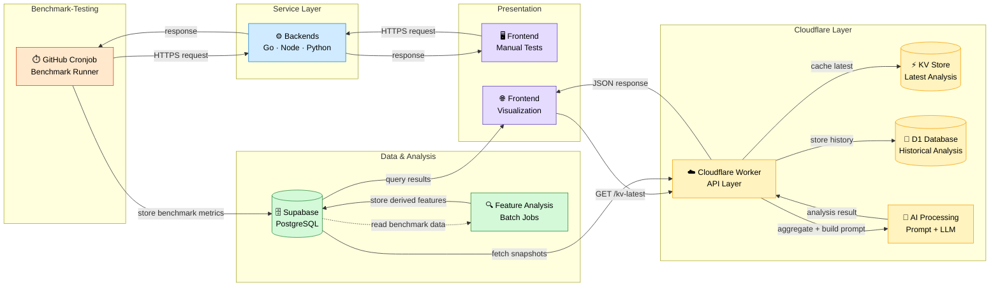

# fs-lab — System Overview

## 🔗 Live Frontend

#### Exploratory access (manual testing and visualization only):

#### [Frontend on Render](https://fs-lab-core-react.onrender.com/)

### 🔍 Key Insights

- Cold vs warm start behavior varies significantly across runtimes under identical hosting conditions
- Platform-induced latency variance can exceed runtime-specific differences
- Real-world environments introduce non-deterministic performance characteristics not visible in synthetic benchmarks

## 🎯 Project Goal

fs-lab is a multi-service system designed to analyze cold and warm start behavior across different backend runtimes (Node.js, Python, Go) under identical hosting conditions.

The system focuses on observing real-world latency, platform-induced variance, and runtime startup characteristics in a production-like environment.

Rather than comparing languages in isolation, the project investigates how runtime, hosting platform, and deployment constraints interact and influence observable performance.

## 🗺️ Architecture Diagram

```mermaid
flowchart LR
    Cron[⏱️ GitHub Cronjob<br/>Benchmark Runner]
    FE_Test[🖥️ Frontend<br/>Manual Tests]
    BE[⚙️ Backends<br/>Go · Node · Python]
    DB[(🗄️ Supabase<br/>PostgreSQL)]
    ML[🔍 Feature Analysis<br/>Batch Jobs]
    FE_View[🌐 Frontend<br/>Visualization]

    CF_Worker[☁️ Cloudflare Worker<br/>API Layer]
    KV[(⚡ KV Store<br/>Latest Analysis)]
    D1[(🧠 D1 Database<br/>Historical Analysis)]
    AI[🤖 AI Processing<br/>Prompt + LLM]

    subgraph Presentation
    FE_Test
    FE_View
    end

    subgraph Service Layer
    BE
    end

    subgraph Data & Analysis
    DB
    ML
    end

    subgraph Benchmark-Testing
    Cron
    end

    subgraph Cloudflare Layer
        CF_Worker
        AI
        KV
        D1
    end

    %% Frontend Consumption
    FE_View -->|GET /kv-latest| CF_Worker
    CF_Worker -->|JSON response| FE_View
    FE_Test -->|HTTPS request| BE
    BE -->|response| FE_Test

    Cron -->|HTTPS request| BE
    BE -->|response| Cron
    Cron -->|store benchmark metrics| DB
    DB -.->|read benchmark data| ML
    ML -->|store derived features| DB
    DB -->|query results| FE_View

    %% Cloudflare AI Pipeline
    DB -->|fetch snapshots| CF_Worker
    CF_Worker -->|aggregate + build prompt| AI
    AI -->|analysis result| CF_Worker
     CF_Worker -->|store history| D1
    CF_Worker -->|cache latest| KV

    classDef benchmark fill:#ffe8cc,stroke:#d9480f,color:#000
    classDef service fill:#d0ebff,stroke:#1c7ed6,color:#000
    classDef data fill:#d3f9d8,stroke:#2b8a3e,color:#000
    classDef frontend fill:#e5dbff,stroke:#5f3dc4,color:#000
    classDef cloud fill:#fff3bf,stroke:#f59f00,color:#000

    class Cron benchmark
    class BE service
    class DB,ML data
    class FE_Test,FE_View frontend
    class KV,D1,CF_Worker,AI cloud
```

## 🧩 System Architecture

The system consists of independently deployed backend services, a centralized data store, asynchronous analysis pipelines, and a decoupled frontend.

Each backend exposes an identical health endpoint and is deployed under the same platform conditions to ensure comparability. Endpoints are triggered via automated benchmarking workflows and manually through the frontend for exploratory inspection.

Automated measurements are collected under controlled conditions and stored as the authoritative dataset. Manual requests are explicitly excluded from analysis to prevent bias.

All analysis is performed asynchronously and fully decoupled from request handling, ensuring that observed latency reflects runtime and platform behavior rather than measurement overhead.

## ⚙️ Components

The system is composed of multiple independent repositories, each with a clearly defined responsibility.

### 🖥️ Backends

Identical backend services implemented in different runtimes and deployed under the same conditions.  
Each service exposes a simple health endpoint used for benchmarking.

- 🟡 **Node.js Backend**  
  Repository: [fs-lab-core-api-node](https://github.com/fs-lab-system/fs-lab-core-api-node)
  Purpose: Measure startup and runtime characteristics of a JavaScript-based server environment.

- 🔵 **Python Backend**  
  Repository: [fs-lab-core-api-python](https://github.com/fs-lab-system/fs-lab-core-api-python)
  Purpose: Measure interpreter-based startup overhead and runtime variance.

- 🟢 **Go Backend**  
   Repository: [fs-lab-core-api-go](https://github.com/fs-lab-system/fs-lab-core-api-go)  
   Purpose: Measure cold and warm start behavior of a compiled, statically linked runtime.

---

### ⏱️ Benchmark & Cronjobs

Automated benchmarking is executed via GitHub Actions workflows.  
These workflows periodically trigger backend endpoints and record detailed timing metrics.

- ⏱️ **Benchmark Cronjobs**  
  Repository: [fs-lab-cron](https://github.com/fs-lab-system/fs-lab-cron)
  Purpose: Execute scheduled measurements and persist results to the central database.

---

### 🧩🔍 Feature Analysis

The system performs structured feature analysis on collected benchmark data.

Raw measurements are transformed into derived features such as cold start classification, time since last invocation, and aggregated latency metrics. This step creates a consistent and analyzable dataset for downstream processing.

Feature analysis operates exclusively on automated benchmark data and is executed asynchronously to avoid influencing measurement results.

- 📈 **Feature Analysis Jobs**  
  Repository: [fs-lab-ml](https://github.com/fs-lab-system/fs-lab-ml)  
  Purpose: Transform raw benchmark data into structured features and enable statistical analysis.

---

### 🌐 Frontend

A static frontend application used for visualization and manual exploration.

- 🌐 **Frontend**  
  Repository: [fs-lab-core-react](https://github.com/fs-lab-system/fs-lab-core-react)  
  Purpose: Visualize raw measurements, analysis results, and enable manual endpoint testing.

---

### ☁️ Cloud Integration Overview

The system includes an edge-based analysis layer implemented with Cloudflare Workers.

Benchmark data is periodically aggregated and transformed into structured inputs for AI-based analysis. Results are persisted in a D1 database, while the latest insights are cached in a KV store for low-latency access.

The frontend interacts exclusively with the Worker via a lightweight HTTP endpoint, avoiding direct database access. This design reduces load on the primary data store and cleanly separates data processing from presentation.

The architecture explores edge execution, caching strategies, and AI-assisted analysis to enable efficient, near real-time insight generation.

- 🌐 **AI-Cloudworker**  
  Repository: [fs-lab-cloud](https://github.com/fs-lab-system/fs-lab-cloud)  
  Purpose: Analyze data using LLMs and store results in KV and D1 (SQLite).

---

## 🔄 Data Flow

The system distinguishes between two different request paths: automated benchmark measurements and manual exploratory requests.

Automated measurements are executed by scheduled GitHub Actions workflows. These workflows periodically trigger the health endpoints of all backend services under controlled conditions. For each request, timing-related metadata such as total response time, timestamp, and backend identifier are collected.

The collected measurements are written directly to a central PostgreSQL database (Supabase). This dataset represents the authoritative source for all benchmarking and performance analysis.

In addition to automated measurements, the frontend allows users to manually trigger backend endpoints. These requests are intended for exploratory testing, debugging, and validation only. Results from manual requests are explicitly excluded from the primary benchmarking dataset and are not used for statistical analysis or machine learning.

All downstream analysis, aggregation, and machine learning processes operate exclusively on the automated benchmark data and are executed asynchronously.

## 📊 Metrics & Measurements

The system records a defined set of metrics to enable consistent comparison across different runtimes and execution conditions.

### Primary Metrics

- **Total Response Time (ms)**  
  End-to-end duration from request initiation to completed HTTP response.  
  This metric represents the externally observable latency and is used as the primary comparison value.

- **Timestamp**  
  UTC timestamp of the measurement, used for time-based aggregation and trend analysis.

- **Backend Identifier**  
  Logical identifier of the backend service (Go, Node.js, Python) to ensure clear attribution.

---

### Derived Metrics

- **Cold Start**  
  A request is classified as a cold start if it occurs after a defined period of backend inactivity or triggers a fresh container/runtime initialization by the hosting platform.

- **Warm Start**  
  A request handled by an already initialized and active backend instance.

- **Time Since Last Invocation**  
  Duration between the current request and the previous invocation of the same backend service.  
  This value is used as an input for cold start classification and analysis.

---

### Measurement Scope and Constraints

- Only automated benchmark measurements generated by scheduled GitHub workflows are considered authoritative.
- Manual requests triggered via the frontend are excluded from statistical analysis and machine learning.
- No application-level instrumentation or tracing is used; all measurements are based on externally observable behavior.
- Metrics are collected uniformly across all runtimes to ensure comparability.

## 🤖 Role of Data Analysis & AI

The system uses a two-stage analysis approach consisting of feature engineering and AI-based interpretation.

Instead of implementing a traditional machine learning pipeline, the project intentionally focuses on exploratory analysis. The engineered features are processed by an AI-based analysis layer using Cloudflare Workers, where aggregated data is transformed into structured prompts and evaluated by language models.

This approach enables flexible interpretation of patterns, anomalies, and runtime behavior without requiring predefined models or training pipelines.

All analysis is performed asynchronously on historical benchmark data and does not influence request handling or system behavior.

The design reflects a deliberate decision to prioritize interpretability and iteration speed over static model training, while still enabling meaningful insights into system performance.

## 🧠 Architectural Decisions

The architecture is intentionally modular and loosely coupled to reflect realistic distributed systems.

Independent services allow isolated deployment and unbiased measurement across runtimes. Asynchronous processing prevents measurement interference and avoids feedback loops.

A centralized data store ensures a single source of truth, while derived data is generated downstream without modifying raw measurements.

The system intentionally avoids runtime instrumentation to maintain comparability and focuses exclusively on externally observable behavior.

### 🧩 Multiple Independent Services

Backend implementations are separated into individual services rather than combined into a monolithic or multi-runtime application. This allows each runtime to be deployed, started, and measured under identical platform conditions without shared state or cross-runtime interference.

### ⏱️ Asynchronous Benchmarking and Analysis

Benchmarking and machine learning are executed asynchronously and outside of the request handling path. This decision avoids measurement bias, prevents feedback loops, and ensures that observed latency reflects platform and runtime behavior rather than instrumentation overhead.

### 🗄️ Centralized, Authoritative Data Store

All benchmark data is persisted in a single PostgreSQL database which serves as the authoritative source for analysis. Derived metrics, aggregations, and machine learning results are computed downstream and never replace or modify raw measurement data.

### 🚫 No Runtime Instrumentation or Tracing

The system intentionally avoids application-level tracing, profiling, or runtime instrumentation. All measurements are based on externally observable behavior to ensure fairness and comparability across different runtimes and implementations.

### 🤖 Analysis as Interpretation, Not Control

All analysis components in this system are designed strictly for interpretation and insight generation.

They do not influence runtime behavior, scaling decisions, or request routing, and operate exclusively on historical benchmark data in asynchronous processing pipelines.

This ensures that measurement results remain unbiased and are not affected by feedback loops or system-side optimizations.

### 🏢 Repository Organization

Repositories are organized as independent projects within a GitHub organization to reflect a realistic multi-service setup. Each repository has a clearly defined responsibility and lifecycle, reducing coupling and improving clarity.

## 🚀 Current State

The core system architecture is implemented and operational.

Multiple backend services (Go, Node.js, Python) are deployed under identical conditions and continuously benchmarked via automated workflows. Collected measurements are stored in a centralized PostgreSQL database.

The frontend enables visualization of collected data and supports exploratory testing, while maintaining strict separation from benchmark data.

An edge-based AI analysis layer processes aggregated data and provides structured insights, enabling ongoing exploration of runtime behavior and platform characteristics.
