# fs-lab — System Overview

## 🎯 Project Goal

fs-lab is a multi-service system designed to benchmark and analyze cold and warm start behavior across different backend runtimes (Node.js, Python, Go) hosted on the same platform.

The project focuses on measuring real-world latency, platform-induced variance, and startup characteristics under identical conditions. All measurements are collected automatically, stored centrally, and analyzed asynchronously.

The goal is not to compare languages in isolation, but to understand how runtime, platform, and deployment characteristics interact in practice.

## 🧩 System Architecture

The system consists of multiple independently deployed backend services, a central data store, asynchronous analysis jobs, and a static frontend.

Each backend service exposes an identical health endpoint and is deployed on the same hosting platform to ensure comparable conditions. Backend endpoints can be triggered both by automated benchmarking workflows and manually via the frontend for interactive inspection.

Automated benchmarking is executed via scheduled GitHub workflows that record detailed timing information under controlled conditions. Manual frontend-triggered requests are intended for exploratory testing and are not used as primary benchmarking data.

All measurements are persisted in a central PostgreSQL database (Supabase). Analysis and machine learning are executed asynchronously in batch jobs and never interfere with request handling or benchmarking.

The frontend is a static application that visualizes raw measurements and derived analysis results.

## 🗺️ Architecture Diagram

```mermaid
flowchart LR
    Cron[⏱️ GitHub Cronjob<br/>Benchmark]
    FE_Test[🖥️ Frontend<br/>Manual Tests]
    BE[⚙️ Backends<br/>Go · Node · Python]
    DB[(🗄️ Supabase<br/>PostgreSQL)]
    ML[🤖 ML / Analysis<br/>Batch Jobs]
    FE_View[🌐 Frontend<br/>Visualization]

    Cron --> BE
    FE_Test --> BE
    BE --> DB
    DB --> ML
    ML --> DB
    DB --> FE_View
```

## ⚙️ Components

### 🖥️ Backends

- Node.js
- Python
- Go

### ⏱️ Benchmark & Cronjobs

### 🤖 ML / Analysis

### 🌐 Frontend

## 🔄 Data Flow

## 📊 Metrics & Measurements

## 🤖 Role of Machine Learning

## 🧠 Architectural Decisions

## 🚀 Current State

## 🛣️ Next Steps
