# fs-lab — System Overview

## 🎯 Project Goal

fs-lab is a multi-service system designed to benchmark and analyze cold and warm start behavior across different backend runtimes (Node.js, Python, Go) hosted on the same platform.

The project focuses on measuring real-world latency, platform-induced variance, and startup characteristics under identical conditions. All measurements are collected automatically, stored centrally, and analyzed asynchronously.

The goal is not to compare languages in isolation, but to understand how runtime, platform, and deployment characteristics interact in practice.

## 🧩 System Architecture

The system consists of multiple independently deployed backend services, a central data store, asynchronous analysis jobs, and a static frontend.

Each backend service exposes an identical health endpoint and is deployed on the same hosting platform to ensure comparable conditions. Backend endpoints can be triggered both by automated benchmarking workflows and manually via the frontend for interactive inspection.

Automated benchmarking is executed via scheduled GitHub workflows that record detailed timing information under controlled conditions. Manual frontend-triggered requests are intended for exploratory testing and are not used as primary benchmarking data.

All measurements are persisted in a central PostgreSQL database (Supabase). Analysis and machine learning are executed asynchronously in batch jobs and never interfere with request handling or benchmarking.

The frontend is a static application that visualizes raw measurements and derived analysis results.

## 🗺️ Architecture Diagram

```mermaid
flowchart LR
    Cron[⏱️ GitHub Cronjob<br/>Benchmark]
    FE_Test[🖥️ Frontend<br/>Manual Tests]
    BE[⚙️ Backends<br/>Go · Node · Python]
    DB[(🗄️ Supabase<br/>PostgreSQL)]
    ML[🤖 ML / Analysis<br/>Batch Jobs]
    FE_View[🌐 Frontend<br/>Visualization]

    Cron --> BE
    FE_Test --> BE
    BE --> DB
    DB --> ML
    ML --> DB
    DB --> FE_View
```

## ⚙️ Components

The system is composed of multiple independent repositories, each with a clearly defined responsibility.

### 🖥️ Backends

Identical backend services implemented in different runtimes and deployed under the same conditions.  
Each service exposes a simple health endpoint used for benchmarking.

- 🟡 **Node.js Backend**  
  Repository: [fs-lab-core-api-node](https://github.com/fs-lab-system/fs-lab-core-api-node)
  Purpose: Measure startup and runtime characteristics of a JavaScript-based server environment.

- 🔵 **Python Backend**  
  Repository: [fs-lab-core-api-python](https://github.com/fs-lab-system/fs-lab-core-api-python)
  Purpose: Measure interpreter-based startup overhead and runtime variance.

- 🟢 **Go Backend**  
   Repository: [fs-lab-core-api-go](https://github.com/fs-lab-system/fs-lab-core-api-go)  
   Purpose: Measure cold and warm start behavior of a compiled, statically linked runtime.

---

### ⏱️ Benchmark & Cronjobs

Automated benchmarking is executed via GitHub Actions workflows.  
These workflows periodically trigger backend endpoints and record detailed timing metrics.

- ⏱️ **Benchmark Cronjobs**  
  Repository: [fs-lab-cron](https://github.com/fs-lab-system/fs-lab-cron)
  Purpose: Execute scheduled measurements and persist results to the central database.

---

### 🤖 ML / Analysis

Offline analysis and machine learning are executed asynchronously and are fully decoupled from request handling.

- 🤖 **ML Analysis Jobs**  
  Repository: planned
  Purpose: Detect anomalies, identify patterns, and derive cold start probabilities from collected data.

---

### 🌐 Frontend

A static frontend application used for visualization and manual exploration.

- 🌐 **Frontend**  
  Repository: [fs-lab-core-react](https://github.com/fs-lab-system/fs-lab-core-react)  
  Purpose: Visualize raw measurements, analysis results, and enable manual endpoint testing.

## 🔄 Data Flow

The system distinguishes between two different request paths: automated benchmark measurements and manual exploratory requests.

Automated measurements are executed by scheduled GitHub Actions workflows. These workflows periodically trigger the health endpoints of all backend services under controlled conditions. For each request, timing-related metadata such as total response time, timestamp, and backend identifier are collected.

The collected measurements are written directly to a central PostgreSQL database (Supabase). This dataset represents the authoritative source for all benchmarking and performance analysis.

In addition to automated measurements, the frontend allows users to manually trigger backend endpoints. These requests are intended for exploratory testing, debugging, and validation only. Results from manual requests are explicitly excluded from the primary benchmarking dataset and are not used for statistical analysis or machine learning.

All downstream analysis, aggregation, and machine learning processes operate exclusively on the automated benchmark data and are executed asynchronously.

## 📊 Metrics & Measurements

## 🤖 Role of Machine Learning

## 🧠 Architectural Decisions

## 🚀 Current State

## 🛣️ Next Steps
